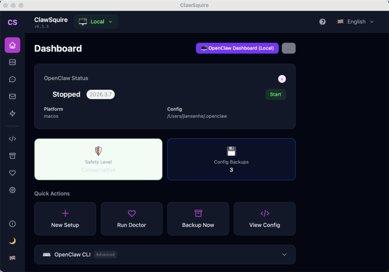

# ClawSquire

[](https://github.com/Jiansen/clawsquire)
[](https://github.com/Jiansen/clawsquire/releases)
[](#languages)
[](LICENSE)
[](https://github.com/Jiansen/clawsquire/releases)
[](https://github.com/Jiansen/clawsquire/actions)

**The AI-powered companion app for [OpenClaw](https://openclaw.ai)** — when things go wrong, your squire's AI agent diagnoses the problem and fixes it. Setup, health checks, config backups, and a visual dashboard so you can focus on what your lobster knight does best.

🌐 [Website](https://clawsquire.com) · 💬 [Discussions](https://github.com/Jiansen/clawsquire/discussions) · 🐛 [Report Bug](https://github.com/Jiansen/clawsquire/issues/new?template=bug_report.yml) · 💡 [Request Feature](https://github.com/Jiansen/clawsquire/issues/new?template=feature_request.yml)

[English](#features) · [中文](#中文) · [日本語](#日本語) · [Español](#español) · [Deutsch](#deutsch) · [Português](#português)

<p align="center">
  
</p>

## Features

### 🤖 AI Agent (v1.0)

- **AI Fix Agent** — When installation or operations fail, an LLM agent diagnoses the error, generates cross-platform shell commands with risk levels, and walks you through the fix
- **AI Assistants Everywhere** — Context-aware AI chat in Health Check (diagnostics), Config (settings help), VPS (server management), and Help pages
- **Direct LLM API** — Agent features work independently of OpenClaw via direct API calls to Anthropic, OpenAI, Google, and DeepSeek
- **Smart Provider Setup** — Choose from 4 top LLM providers with official logos and strongest model recommendations (Claude Opus 4.6, GPT-5.4, Gemini 3.1 Pro, DeepSeek V3.2)

### 🛠️ Core

- **Setup Assistant** — Guided installation with scene templates (Telegram, Discord, WhatsApp, Slack, and 20+ more channels)
- **Health Check** — Visual diagnostics, friendlier than `openclaw doctor`
- **Config Backups** — Versioned snapshots with diff and one-click rollback
- **Dashboard** — See your OpenClaw status at a glance
- **Safety Presets** — Conservative / Standard / Full security levels with one-click apply
- **System Tray** — Runs quietly in background; close the window and it stays in your tray
- **Auto-Update** — Detects new releases from GitHub and shows a one-click download banner
- **Error Recovery** — Global error boundary with one-click recovery and bug reporting
- **Feedback** — One-click bug reports with auto-collected diagnostics, screenshots, and environment info

## Download

🚀 **v1.0.0** — [Download for macOS, Windows, or Linux →](https://github.com/Jiansen/clawsquire/releases/latest)

| Platform | Format |
|----------|--------|
| macOS (Apple Silicon) | `.dmg` |
| macOS (Intel) | `.dmg` |
| Windows | `.msi` |
| Linux (Debian/Ubuntu) | `.deb` |
| Linux (universal) | `.AppImage` |

### macOS: First Launch

This release is not code-signed. Run this once after installing:

```bash
xattr -rd com.apple.quarantine /Applications/ClawSquire.app
open /Applications/ClawSquire.app
```

## Quick Start (Development)

```bash
# Prerequisites: Rust, Node.js ≥22, pnpm
git clone https://github.com/Jiansen/clawsquire.git
cd clawsquire
pnpm install
pnpm tauri dev
```

> [OpenClaw](https://openclaw.ai/) is recommended but not required to explore the UI. ClawSquire gracefully handles the case when OpenClaw is not installed.

## Languages

EN 🇬🇧 · 简体中文 🇨🇳 · 繁體中文 🇭🇰 · 日本語 🇯🇵 · Español 🇪🇸 · Deutsch 🇩🇪 · Português 🇧🇷

ClawSquire automatically detects your system language. You can also switch languages from the header.

## Tech Stack

- **Frontend**: React 19 + Vite 7 + Tailwind CSS 4
- **Backend**: Rust (Tauri 2)
- **AI**: Direct LLM API integration (Anthropic, OpenAI, Google Gemini, DeepSeek)
- **i18n**: i18next (7 languages)
- **OpenClaw interface**: CLI wrapper + direct LLM fallback when OpenClaw is unavailable

## License

MIT

---

## 中文

**ClawSquire** 是 OpenClaw 的 AI 伴侣应用——出了问题，AI Agent 诊断原因、生成修复命令。像骑士的侍从一样，帮你穿戴配置、检查装备、保管物资、掌握全局。

### 功能

- **AI 修复代理** — 安装/操作失败时，LLM Agent 自动诊断并生成跨平台修复命令
- **AI 助手** — 健康检查、配置管理、VPS 管理、帮助页面均内嵌智能问答
- **安装向导** — 场景化配置模板（Telegram、WhatsApp、Discord、Slack 等 20+ 渠道）
- **健康检查** — 可视化诊断，比 `openclaw doctor` 更友好
- **配置备份** — 版本化快照 + 差异对比 + 一键回滚
- **仪表盘** — 一眼看清 OpenClaw 运行状态

---

## 日本語

**ClawSquire** は OpenClaw のコンパニオンアプリです。セットアップ、設定診断、バージョン管理バックアップ、ビジュアルダッシュボードをお任せください。

### 機能

- **セットアップアシスタント** — シーンテンプレートによるガイド付きインストール
- **ヘルスチェック** — ビジュアル診断
- **設定バックアップ** — バージョン管理されたスナップショット
- **ダッシュボード** — OpenClaw のステータスを一目で確認

---

## Español

**ClawSquire** es la app compañera de OpenClaw — tu escudero que se encarga de la configuración, diagnósticos, copias de seguridad y un panel visual.

### Características

- **Asistente de configuración** — Instalación guiada con plantillas de escenarios
- **Diagnóstico** — Verificación visual de salud del sistema
- **Respaldos** — Snapshots versionados con comparación y restauración
- **Panel** — Estado de OpenClaw de un vistazo

---

## Deutsch

**ClawSquire** ist die Begleit-App für OpenClaw — dein Knappe kümmert sich um Einrichtung, Systemprüfung, Konfigurationssicherungen und ein visuelles Dashboard.

---

## Português

**ClawSquire** é o app companheiro do OpenClaw — seu escudeiro cuida da configuração, diagnósticos, backups e um painel visual.

---

## Contributing

We welcome contributions of all kinds:

- **Bug reports** — [Open an issue](https://github.com/Jiansen/clawsquire/issues/new?template=bug_report.yml)
- **Feature ideas** — [Request a feature](https://github.com/Jiansen/clawsquire/issues/new?template=feature_request.yml)
- **Translations** — Help us improve existing translations or add new languages
- **Code** — PRs are welcome! See the Quick Start section above to set up your dev environment
- **Discussions** — [Join the conversation](https://github.com/Jiansen/clawsquire/discussions)

If you find ClawSquire useful, please ⭐ star the repo — it helps others discover us!

---

## Star History

[](https://star-history.com/#Jiansen/clawsquire&Date)
